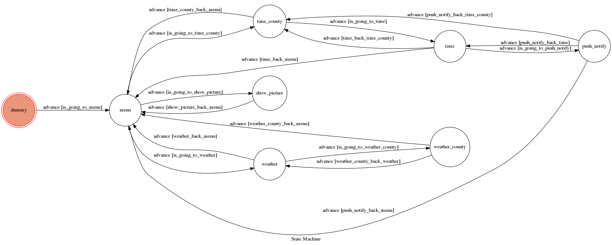
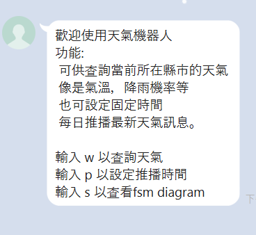

# TOChomework

## Finite State Machine

## Usage

* user
	* Input: "w"
		*  可以用中文或數字選擇要查詢天氣的台灣縣市 -> 可輸入"c"重新選擇縣市
	* Input: "p"
		*  可以用中文或數字選擇要每日推播天氣的台灣縣市 ->之後可以點選圖片選擇要推播天氣的時間，或是輸入"c"重新選擇縣市-> 
		   進入推播模式:可輸入"c"重新選擇縣市和時間，可輸入"t"重新選擇時間
	* Input: "s"
		*  秀出fsm diagram 
		
任一階段都能輸入"m"回到功能選單選擇上面三者其一

## image

